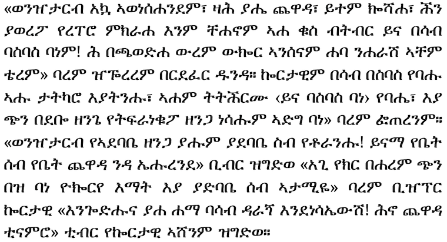

# ethiop

This is convesion of the Metafont outlines from the "ethiop" LaTeX package v0.7, 
developed by Berhanu Beyene, Manfred Kudlek, Olaf Kummer, and Jochen Metzinger.
Conversion was performed with the [mf2ff.py utility](https://github.com/mf2vec-dev/mf2ff).
The converted glyphs were refined and kerned by type designer Abraham Fikadu. Abraham also
extended the glyph set to cover updates to the Unicode standard for Ethiopic since the
last release of the ethiop package.

The ethiop archive can be found in CTAN at: 

  [https://ctan.org/tex-archive/language/ethiopia/ethiop](https://ctan.org/tex-archive/language/ethiopia/ethiop)

and original homepage is found at:

  [https://www2.informatik.uni-hamburg.de/TGI/mitarbeiter/wimis/kummer/ethiop_eng.html](https://www2.informatik.uni-hamburg.de/TGI/mitarbeiter/wimis/kummer/ethiop_eng.html)

## Sample

From: <i>Gebreyesus, Hailemariam. የጫሙት ሽካ. (Yechamut Shika) Addis Ababa: Birhanina Selam Printing Press, 1981 E.C.</i>

## Relationship to GNU FreeSerif
The ethiop glyphs were previously ported to TrueType for inclusion in the [GNU FreeFont](https://www.gnu.org/software/freefont/index.html)
project and can be found in the GNU "FreeSerif" typeface since 2002. Glyph conversion
in this project was performed with a more modern (though not necessarily better)
algorithm and the outcome were extensively reviewed and refined by a professional type designer.

At present, the FreeSerif typeface has coverage limited to Unicode's [Ethiopic Basic range](https://en.wikipedia.org/wiki/Ethiopic_(Unicode_block)).
Under *this* effort, glyph additions have been made to cover the ranges:
[Ethiopic Supplement](https://en.wikipedia.org/wiki/Ethiopic_Supplement),
[Ethiopic Extended](https://en.wikipedia.org/wiki/Ethiopic_Extended),
[Ethiopic Extended-A](https://en.wikipedia.org/wiki/Ethiopic_Extended-A),
and [Ethiopic Extended-B](https://en.wikipedia.org/wiki/Ethiopic_Extended-B),
not found in the FreeSerif typeface.  Anchor points for combining marks, and letter pair kerning,
are other enhancements made to the typeface.

It is a goal of this effort to offer the glyphs enhancements back to the GNU FreeSerif
project.

## License
The ethiop typeface inherits the [GNU GPLv2 License](https://www.gnu.org/licenses/old-licenses/gpl-2.0.en.html)
from the original [LaTeX project](https://ctan.org/tex-archive/language/ethiopia/ethiop) of the same name.
